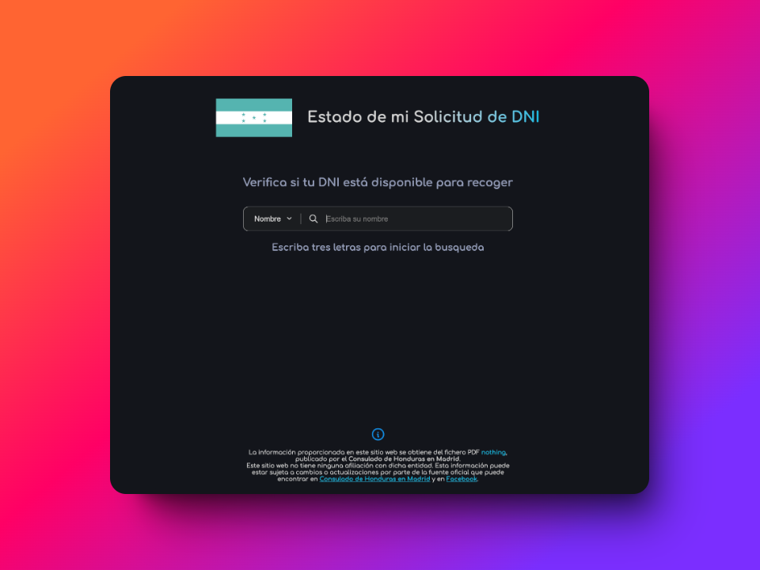
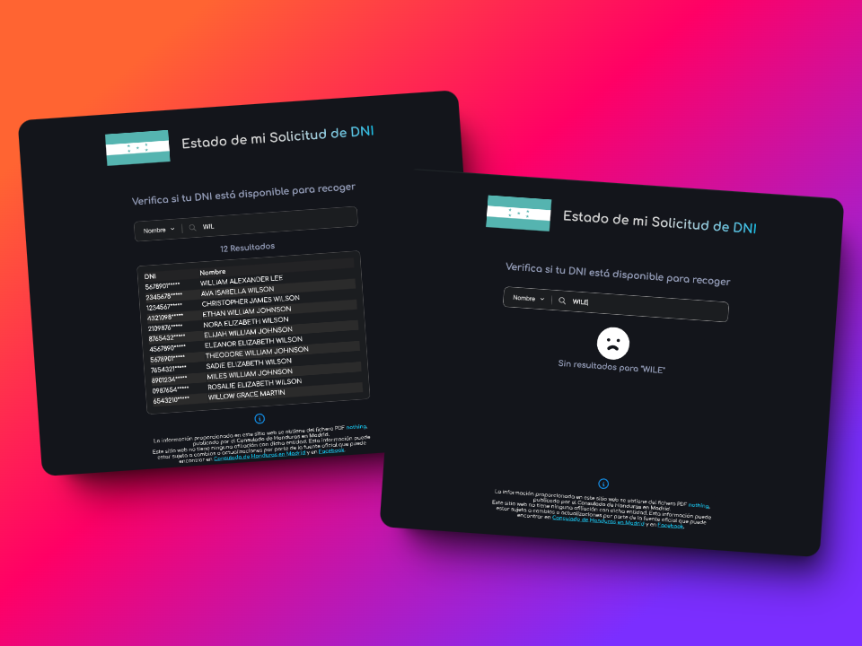

# DNI Ready Pickup Search - Honduran Consulate, Madrid

## Overview

This application helps Honduran citizens in Madrid check if their DNI (National Identity Document) is ready for pickup
at the Consulate. It provides a simple search interface where users can enter their name or partial ID number to see if
their DNI is available.

## Current Features

* **Search by Name or ID:** Users can choose to search by either their full name or a partial ID number.
* **Real-Time Data:** The application utilizes an API that reads the official PDF list provided by the Consulate,
  ensuring the data is always up-to-date.
* **Dynamic Search:** As the user types, matching results are displayed in real-time.
* **Clear Notifications:** If no matching results are found, a clear message is displayed to inform the user.

## Important Notes

* **Fictitious Data (for now):** Currently, the application is populated with fictitious names for testing purposes.
  However, it has been successfully tested with real data. Due to the size of the real data is not feasible to provide
  it from the server itself.
* **Data Source:** The real data used by this application is obtained from the official PDF list provided by the
  Consulate of Honduras in Madrid.
* **API Integration:** The application relies on an API that processes the PDF, extracts the relevant data, and
  transforms it into a JSON format for easy use within the application.
* **Search Accuracy:** The search functionality requires a minimum of 3 letters or numbers to start displaying results.
  Users are encouraged to be as accurate as possible when entering their search terms.

## Disclaimer

This application is intended to provide a convenient way for Honduran citizens to check the availability of their DNI at
the Consulate in Madrid. While every effort is made to ensure the accuracy of the information, the developers cannot be
held responsible for any errors or discrepancies in the data. Please always refer to the official announcements from the
Consulate of Honduras for the most up-to-date information.

**Este sitio web no tiene ninguna afiliación con dicha entidad. Esta información puede estar sujeta a
cambios o actualizaciones por parte de la fuente oficial que puede encontrar en
[Consulado de Honduras en Madrid](https://www.consuladohondurasmadrid.es/) y en
[Facebook](https://www.facebook.com/consuladodehondurasenmadrid).**